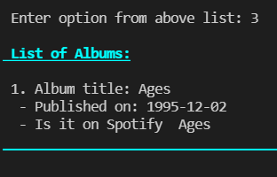
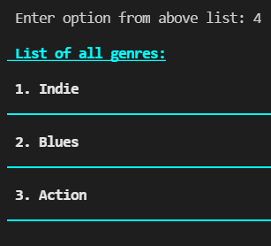

# Ruby-Capstone-Project

This project is a console app that will help you keep a record of different types of things you own: books, music albums and games.
Everything will be based on the UML class diagram attached below.
The data will be stored in JSON files.
It also contains a schema.sql file with tables that are analogical to the structure of the classes in the app.
## Screenshots

> |Screenshot 1|Screenshots 2|
> |--------------|----------------|
> |||!
> |Screenshot 3|Screenshots 4|
> |--------------|----------------|
> |||!
> |Screenshot 5|Screenshots 6|
> |--------------|----------------|
> |||!

## Built With
- Ruby
- PostgreSQL
- RSpec
  
## Setup
- Get the link of the repository: [https://github.com/chaw-bot/Ruby-Capstone-Project](https://github.com/chaw-bot/Ruby-Capstone-Project)
- Clone it as [git@github.com:chaw-bot/Ruby-Capstone-Project.git](git@github.com:chaw-bot/Ruby-Capstone-Project.git) on a Terminal
- Usage
- Run bundle install on a Terminal to get Gemfile dependencies.
- Run irb on a Terminal
  
## Authors

👤 **Chawanzi Ng'uni**

- GitHub: [@chaw-bot](https://github.com/chaw-bot)
- Twitter: [@chaw36422087](https://twitter.com/chaw36422087)
- LinkedIn: [Chawanzi Ng'uni](https://www.linkedin.com/in/chawanzi-ng-uni-449328212/)

👤 **Author**

- Name: Ajise Toluwase
- GitHub: [@githubhandle](https://github.com/Whoistolu)
- Twitter: [@twitterhandle](https://twitter.com/Littletolu)
- LinkedIn: [LinkedIn](https://www.linkedin.com/in/toluwase-ajise-9b40411b2/)
  
👤 **Willy Ntazama**

- GitHub: [@ntzwilly](https://github.com/ntzwilly)
- LinkedIn: [@ntazamawilly](https://linkedin.com/in/ntazama-willy-b676b7aa)

## 🤝 Contributing

Contributions, issues, and feature requests are welcome!

Feel free to check the [issues page](https://github.com/chaw-bot/OOP-School-Library/issues).

## Show your support

Give a ⭐️ if you like this project!

## Acknowledgments
- Microverse
- Ruby documentation
- Stack Overflow